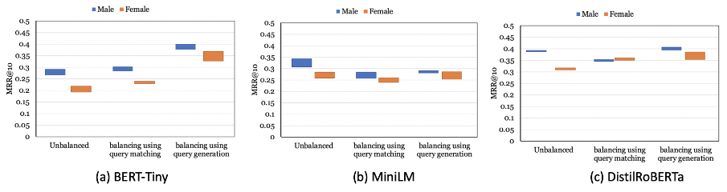

# Addressing Gender-related Performance Disparities in Neural Rankers

This repository contains the code and resources for the paper 
"Addressing Gender-related Performance Disparities in Neural Rankers". 
In this paper, we investigate whether neural rankers introduce retrieval 
effectiveness (performance) disparities over queries related to different genders.
We specifically study whether there are significant performance differences between
male and female queries when retrieved by neural rankers. Through our empirical 
study over the MS MARCO collection, we find that such performance disparities are
notable (see Table 1) and that the performance disparities may be due to the difference between
how queries and their relevant judgements are collected and distributed for 
different gendered queries.  More specifically, we observe that male queries
are more closely associated with their relevant documents compared to female
queries and hence neural rankers are able to more easily learn associations
between male queries and their relevant documents. We show that it is possible
to systematically balance relevance judgment collections in order to reduce
performance disparity between different gendered queries without negatively 
compromising overall model performance.
We report our findings in Table 1 and figures 1 and 2.
#### Table 1. Performance of the neural ranker on gendered queries (MRR@10).
<table style= margin-left:auto;margin-right:auto;">
    <tr>
        <td></td>
        <td>Male</td>
        <td>Female</td>
        <td>Difference (%)</td>
    </tr>
    <tr>
        <td>BERT-tiny</td>
        <td>0.4065</td>
        <td> 0.3397</td>
        <td>19.66</td>
    </tr>
    <tr>
        <td>MiniLM</td>
        <td>0.4913</td>
        <td>0.4292</td>
        <td>14.47</td>
    </tr>
    <tr>
        <td>BM25</td>
        <td>0.2783</td>
        <td>0.2284</td>
        <td>21.85</td>
    </tr>
</table>

    

#### Figure1. Distribution of the degree of association between queries and their relevance judgments for both male and female queries (a) on the MS MARCO training set, (b) after systematically balancing using query generation., and (c) after systematically balancing using query matching.

    

#### Figure2. Performance of neural rankers trained on unbalanced and balanced query sets with query matching and query generation.

## Dataset

We perform our experoments on the MSMARCO training dataset. The unbalanced female and male query sets as well as the two balanced sets are provided in [data](https://github.com/shirinssalehi/Addressing-Gender-related-Performance-Disparities-in-Neural-Rankers/tree/main/data).

## Usage

In order to create a balanced query set from the training data One should follow these steps:

1) As the first step, given a query set Q, gender of the queries should be identified using a gender classifier. For this purpose we employed the [gender classifier model](https://github.com/aminbigdeli/Text-Classification-using-Transformers) proposed by Bigdeli et. al. and selected 14K female as well as 14K male queries from the MSMARCO training set queries. The resulting female and male queries are provided in [data/female_train.tsv](https://github.com/shirinssalehi/Addressing-Gender-related-Performance-Disparities-in-Neural-Rankers/tree/main/data/female_train.tsv), and [data/male_train.tsv](https://github.com/shirinssalehi/Addressing-Gender-related-Performance-Disparities-in-Neural-Rankers/tree/main/data/male_train.tsv) respectively.
                                                                                  
2) Calculate BM25 scores of each of the queries and their corresponding relevant document using [calculate_bm25_scores.py](https://b10200cbde7d/r/gender-related-performance-gap-9BBF/calculate_bm25_scores.py).
                                                                                  
3) Finally, the balanced query set is generated with either of these two strategies which are explained in the following.

#### Query Matching
In order to create the balanced query set with the "query matching" strategy run [query_matching.py](https://b10200cbde7d/r/gender-related-performance-gap-9BBF/query_matching.py).
The balanced female and male queries are provided in [data/female_balanced_query_matching.tsv](https://b10200cbde7d/r/gender-related-performance-gap-9BBF/data/female_balanced_query_matching.tsv) and [data/male_balanced_query_matching.tsv](https://b10200cbde7d/r/gender-related-performance-gap-9BBF/data/male_balanced_query_matching.tsv), respectively.

#### Query Generation

1) For each pair of (query, relevant document) in the unbalanced data, we generate 1000 queries from the relevant document. For this purpose, we employ [doct5Query](https://github.com/castorini/docTTTTTquery).
                                                                   
2) For each of the generated queries, the BM25 score between the generated query and it's relevant document is calculated using [calculate_bm25_scores.py](https://github.com/shirinssalehi/Addressing-Gender-related-Performance-Disparities-in-Neural-Rankers/blob/main/calculate_bm25_scores.py).
3) The balancing queries are added to the dataset with the script [query_generation.py](https://github.com/shirinssalehi/Addressing-Gender-related-Performance-Disparities-in-Neural-Rankers/blob/main/query_generation.py).
                                                                   
The balanced female and male queries are provided in [female_balanced_query_generation.tsv](https://github.com/shirinssalehi/Addressing-Gender-related-Performance-Disparities-in-Neural-Rankers/tree/main/data/female_balanced_query_generation.tsv) and [female_balanced_query_generation.tsv](https://github.com/shirinssalehi/Addressing-Gender-related-Performance-Disparities-in-Neural-Rankers/tree/main/data/female_balanced_query_generation.tsv), respectively.

